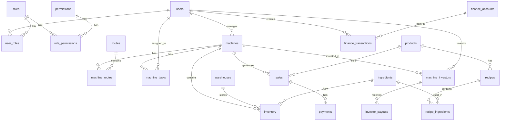

# Схема базы данных VendHub

## Основные принципы:
- Все таблицы имеют `id`, `created_at`, `updated_at`
- Историчность: `action_timestamp` (когда произошло) и `entry_timestamp` (когда внесено)
- Soft delete: `deleted_at` для критичных данных
- UUID для внешних ID (безопасность)
- JSONB для гибких данных (метаданные, настройки)

## ER-диаграмма



## Таблицы

### 1. **users** - Пользователи
```sql
CREATE TABLE users (
    id SERIAL PRIMARY KEY,
    uuid UUID DEFAULT gen_random_uuid() UNIQUE,
    telegram_id BIGINT UNIQUE,
    phone VARCHAR(20) UNIQUE,
    email VARCHAR(255) UNIQUE,
    username VARCHAR(100) UNIQUE,
    full_name VARCHAR(255) NOT NULL,
    password_hash VARCHAR(255),
    is_active BOOLEAN DEFAULT true,
    is_verified BOOLEAN DEFAULT false,
    last_login TIMESTAMP,
    settings JSONB DEFAULT '{}',
    created_at TIMESTAMP DEFAULT CURRENT_TIMESTAMP,
    updated_at TIMESTAMP DEFAULT CURRENT_TIMESTAMP,
    deleted_at TIMESTAMP
);
```

### 2. **roles** - Роли
```sql
CREATE TABLE roles (
    id SERIAL PRIMARY KEY,
    name VARCHAR(50) UNIQUE NOT NULL,
    display_name VARCHAR(100),
    description TEXT,
    is_system BOOLEAN DEFAULT false,
    created_at TIMESTAMP DEFAULT CURRENT_TIMESTAMP
);

-- Предустановленные роли
INSERT INTO roles (name, display_name, is_system) VALUES
('admin', 'Администратор', true),
('manager', 'Менеджер', true),
('warehouse', 'Склад', true),
('operator', 'Оператор', true),
('investor', 'Инвестор', true);
```

### 3. **permissions** - Разрешения
```sql
CREATE TABLE permissions (
    id SERIAL PRIMARY KEY,
    module VARCHAR(50) NOT NULL,
    action VARCHAR(50) NOT NULL,
    description TEXT,
    UNIQUE(module, action)
);
```

### 4. **machines** - Автоматы
```sql
CREATE TABLE machines (
    id SERIAL PRIMARY KEY,
    uuid UUID DEFAULT gen_random_uuid() UNIQUE,
    code VARCHAR(20) UNIQUE NOT NULL,
    name VARCHAR(255) NOT NULL,
    type VARCHAR(50) NOT NULL, -- coffee, snack, combo
    model VARCHAR(100),
    serial_number VARCHAR(100),
    status VARCHAR(50) DEFAULT 'active', -- active, maintenance, inactive
    location_address TEXT,
    location_lat DECIMAL(10, 8),
    location_lng DECIMAL(11, 8),
    installation_date DATE,
    last_service_date DATE,
    responsible_user_id INTEGER REFERENCES users(id),
    settings JSONB DEFAULT '{}',
    metadata JSONB DEFAULT '{}',
    created_at TIMESTAMP DEFAULT CURRENT_TIMESTAMP,
    updated_at TIMESTAMP DEFAULT CURRENT_TIMESTAMP,
    deleted_at TIMESTAMP
);
```

### 5. **ingredients** - Ингредиенты
```sql
CREATE TABLE ingredients (
    id SERIAL PRIMARY KEY,
    code VARCHAR(50) UNIQUE NOT NULL,
    name VARCHAR(255) NOT NULL,
    category VARCHAR(50), -- coffee, syrup, milk, snack, etc
    unit VARCHAR(20) NOT NULL, -- kg, l, pcs
    cost_per_unit DECIMAL(10, 2),
    min_stock_level DECIMAL(10, 3),
    barcode VARCHAR(100),
    supplier_info JSONB DEFAULT '{}',
    created_at TIMESTAMP DEFAULT CURRENT_TIMESTAMP,
    updated_at TIMESTAMP DEFAULT CURRENT_TIMESTAMP
);
```

### 6. **inventory** - Остатки
```sql
CREATE TABLE inventory (
    id SERIAL PRIMARY KEY,
    ingredient_id INTEGER REFERENCES ingredients(id),
    location_type VARCHAR(50) NOT NULL, -- warehouse, machine, bag
    location_id INTEGER NOT NULL, -- warehouse_id, machine_id, task_id
    quantity DECIMAL(10, 3) NOT NULL,
    batch_number VARCHAR(100),
    expiry_date DATE,
    action_timestamp TIMESTAMP NOT NULL, -- когда фактически
    entry_timestamp TIMESTAMP DEFAULT CURRENT_TIMESTAMP, -- когда внесено
    created_by INTEGER REFERENCES users(id),
    notes TEXT
);

CREATE INDEX idx_inventory_location ON inventory(location_type, location_id);
CREATE INDEX idx_inventory_timestamp ON inventory(action_timestamp);
```

### 7. **products** - Продукты
```sql
CREATE TABLE products (
    id SERIAL PRIMARY KEY,
    code VARCHAR(50) UNIQUE NOT NULL,
    name VARCHAR(255) NOT NULL,
    category VARCHAR(50),
    price DECIMAL(10, 2) NOT NULL,
    vat_rate DECIMAL(4, 2) DEFAULT 0.12,
    is_active BOOLEAN DEFAULT true,
    created_at TIMESTAMP DEFAULT CURRENT_TIMESTAMP,
    updated_at TIMESTAMP DEFAULT CURRENT_TIMESTAMP
);
```

### 8. **recipes** - Рецепты
```sql
CREATE TABLE recipes (
    id SERIAL PRIMARY KEY,
    product_id INTEGER REFERENCES products(id),
    version INTEGER DEFAULT 1,
    is_active BOOLEAN DEFAULT true,
    created_at TIMESTAMP DEFAULT CURRENT_TIMESTAMP
);

CREATE TABLE recipe_ingredients (
    id SERIAL PRIMARY KEY,
    recipe_id INTEGER REFERENCES recipes(id),
    ingredient_id INTEGER REFERENCES ingredients(id),
    quantity DECIMAL(10, 3) NOT NULL,
    UNIQUE(recipe_id, ingredient_id)
);
```

### 9. **sales** - Продажи
```sql
CREATE TABLE sales (
    id SERIAL PRIMARY KEY,
    uuid UUID DEFAULT gen_random_uuid() UNIQUE,
    machine_id INTEGER REFERENCES machines(id),
    product_id INTEGER REFERENCES products(id),
    quantity INTEGER NOT NULL DEFAULT 1,
    unit_price DECIMAL(10, 2) NOT NULL,
    total_amount DECIMAL(10, 2) NOT NULL,
    payment_method VARCHAR(50), -- cash, payme, click, uzum
    transaction_id VARCHAR(255),
    action_timestamp TIMESTAMP NOT NULL,
    entry_timestamp TIMESTAMP DEFAULT CURRENT_TIMESTAMP,
    sync_status VARCHAR(50) DEFAULT 'pending',
    raw_data JSONB
);

CREATE INDEX idx_sales_machine_date ON sales(machine_id, action_timestamp);
CREATE INDEX idx_sales_sync ON sales(sync_status);
```

### 10. **finance_accounts** - Финансовые счета
```sql
CREATE TABLE finance_accounts (
    id SERIAL PRIMARY KEY,
    code VARCHAR(50) UNIQUE NOT NULL,
    name VARCHAR(255) NOT NULL,
    type VARCHAR(50) NOT NULL, -- cash, bank, wallet
    currency VARCHAR(3) DEFAULT 'UZS',
    balance DECIMAL(15, 2) DEFAULT 0,
    is_active BOOLEAN DEFAULT true,
    created_at TIMESTAMP DEFAULT CURRENT_TIMESTAMP
);
```

### 11. **finance_transactions** - Финансовые транзакции
```sql
CREATE TABLE finance_transactions (
    id SERIAL PRIMARY KEY,
    uuid UUID DEFAULT gen_random_uuid() UNIQUE,
    type VARCHAR(50) NOT NULL, -- income, expense, transfer
    category VARCHAR(100),
    from_account_id INTEGER REFERENCES finance_accounts(id),
    to_account_id INTEGER REFERENCES finance_accounts(id),
    amount DECIMAL(15, 2) NOT NULL,
    description TEXT,
    reference_type VARCHAR(50), -- sale, purchase, salary, etc
    reference_id INTEGER,
    action_timestamp TIMESTAMP NOT NULL,
    entry_timestamp TIMESTAMP DEFAULT CURRENT_TIMESTAMP,
    created_by INTEGER REFERENCES users(id),
    attachments JSONB DEFAULT '[]',
    metadata JSONB DEFAULT '{}'
);

CREATE INDEX idx_finance_date ON finance_transactions(action_timestamp);
CREATE INDEX idx_finance_category ON finance_transactions(category);
```

### 12. **machine_investors** - Инвесторы в автоматы
```sql
CREATE TABLE machine_investors (
    id SERIAL PRIMARY KEY,
    machine_id INTEGER REFERENCES machines(id),
    user_id INTEGER REFERENCES users(id),
    investment_amount DECIMAL(15, 2) NOT NULL,
    share_percentage DECIMAL(5, 2) NOT NULL,
    investment_date DATE NOT NULL,
    is_active BOOLEAN DEFAULT true,
    created_at TIMESTAMP DEFAULT CURRENT_TIMESTAMP,
    UNIQUE(machine_id, user_id)
);
```

### 13. **audit_log** - Аудит всех действий
```sql
CREATE TABLE audit_log (
    id SERIAL PRIMARY KEY,
    user_id INTEGER REFERENCES users(id),
    action VARCHAR(100) NOT NULL,
    entity_type VARCHAR(50),
    entity_id INTEGER,
    old_data JSONB,
    new_data JSONB,
    ip_address INET,
    user_agent TEXT,
    created_at TIMESTAMP DEFAULT CURRENT_TIMESTAMP
);

CREATE INDEX idx_audit_user ON audit_log(user_id);
CREATE INDEX idx_audit_entity ON audit_log(entity_type, entity_id);
```

## Индексы для производительности

```sql
-- Часто используемые запросы
CREATE INDEX idx_users_telegram ON users(telegram_id) WHERE deleted_at IS NULL;
CREATE INDEX idx_machines_status ON machines(status) WHERE deleted_at IS NULL;
CREATE INDEX idx_inventory_current ON inventory(location_type, location_id, ingredient_id) 
    WHERE action_timestamp = (SELECT MAX(action_timestamp) FROM inventory i2 
    WHERE i2.location_type = inventory.location_type 
    AND i2.location_id = inventory.location_id 
    AND i2.ingredient_id = inventory.ingredient_id);
```

## Триггеры

```sql
-- Автообновление updated_at
CREATE OR REPLACE FUNCTION update_updated_at_column()
RETURNS TRIGGER AS $$
BEGIN
    NEW.updated_at = CURRENT_TIMESTAMP;
    RETURN NEW;
END;
$$ language 'plpgsql';

CREATE TRIGGER update_users_updated_at BEFORE UPDATE ON users
    FOR EACH ROW EXECUTE FUNCTION update_updated_at_column();
-- Повторить для всех таблиц с updated_at
```